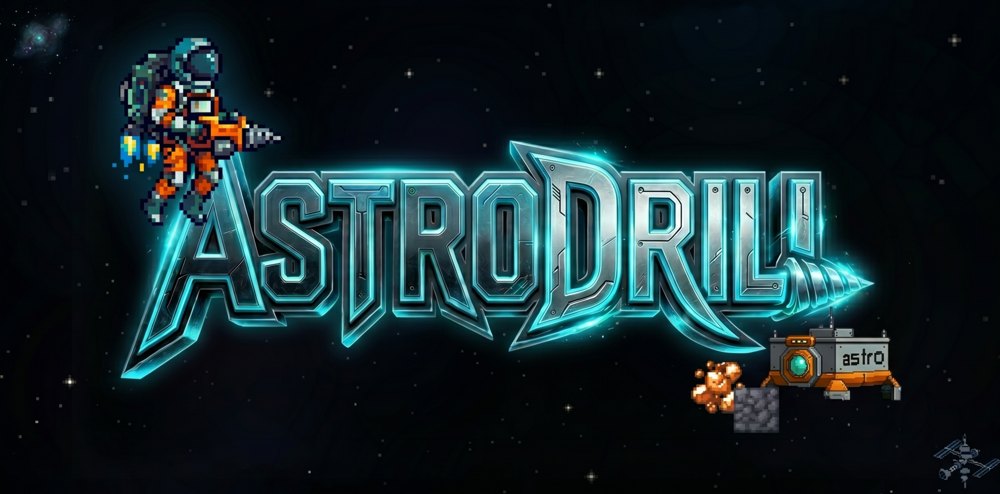
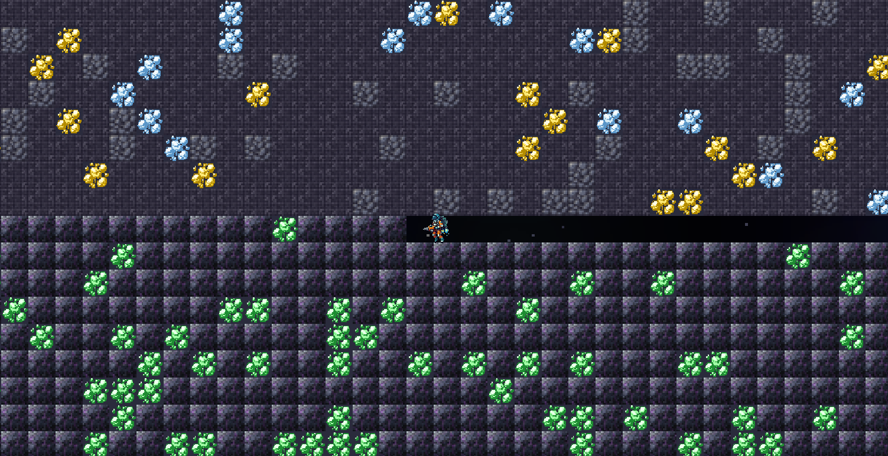
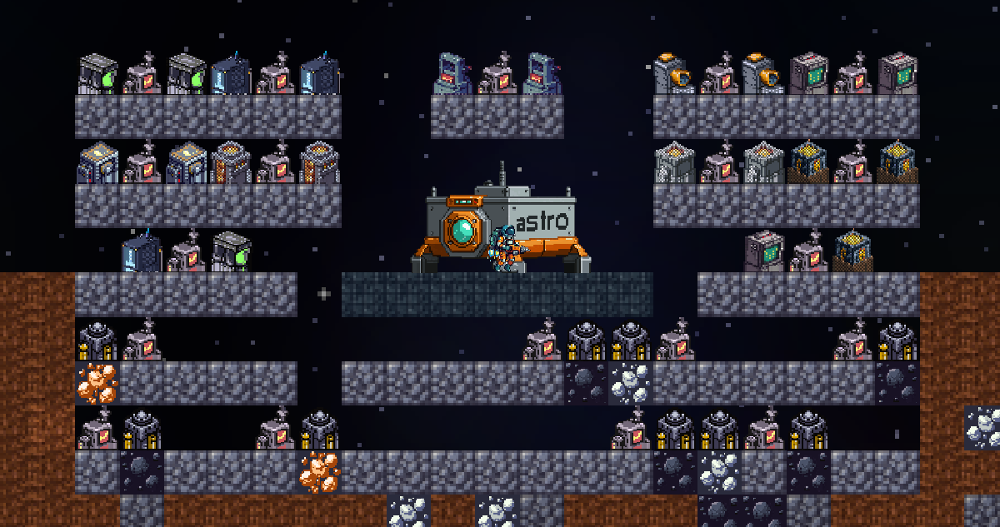
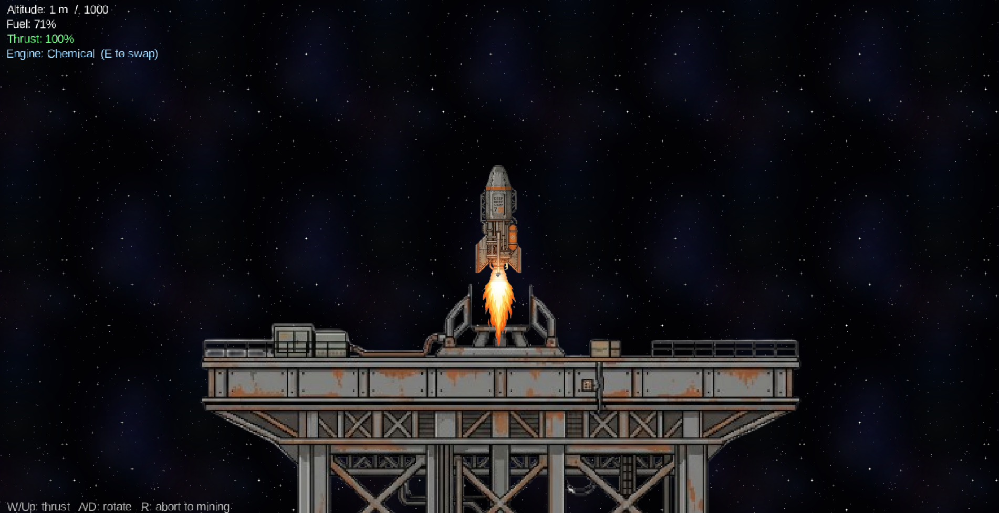

<p align="center">
  
</p>

<p align="center">
  <a href="https://davidalexanderr.itch.io/astrodrill"><strong>▶ Play on Itch.io</strong></a>
  &nbsp;·&nbsp;
  <a href="#quick-start">Quick Start</a>
  &nbsp;·&nbsp;
  <a href="#architecture-highlights">Architecture</a>
  &nbsp;·&nbsp;
  <a href="#backend-api">API</a>
</p>

---

# AstroDrill: Cosmic Factory

A 2D sandbox factory-automation and mining game, built from scratch in Java with [LibGDX](https://libgdx.com/) on a [Spring Boot](https://spring.io/projects/spring-boot) backend.

The player crash-lands in a drop pod (the **LanderHub**), starts with nothing but a hand-drill, and must conquer a 100×300 procedural world by designing a sprawling, multi-tiered factory, then build an escape rocket and fly away.

## Screenshots

<p align="center">
  
  
  
</p>
<p align="center">Mining · Factory · Escape Flight</p>

## The Gameplay Loop

1. **Survive & Dig.** Manage a draining jetpack battery as you venture into hostile geological strata. Return to the LanderHub safe zone to recharge before you stall mid-shaft.
2. **Automate.** Graduate from hand-mining to a network of Auto-Miners, Smelters, Assemblers, Refineries and Fabs, all wired together by an **adjacency-based power grid** of Coal Generators.
3. **Hubgrade.** Upgrading the LanderHub is necessary before unlocking the next layer (Crust → Mantle → Core), though you might want to automate the previous tier of materials first.
4. **Escape.** Refine endgame materials (Rocket Fuel, Hull Plating, Circuit Boards) and launch a Box2D-simulated rocket from the surface. Reach altitude ≥ 1000 to win.

### Win condition

| Requirement | Amount |
| --- | --- |
| ROCKET_FUEL  | 20 |
| HULL_PLATING | 10 |
| CIRCUIT_BOARD | 5 |

Stand inside the LanderHub safe zone with all three in the global vault, press **L** (or use the Launch tab), and you'll enter the flight phase. Hit altitude 1000 → `ESCAPE SUCCESSFUL`. Run out of fuel below 1000 → `CRASH - OUT OF FUEL`.

### Controls

| Phase | Key | Action |
| --- | --- | --- |
| Mining | `A` / `D` (or arrows) | Move left / right |
| Mining | `W` / `↑` | Jetpack thrust (drains battery) |
| Mining | `1`–`9` | Select hotbar slot (slot 9 = Deconstruct Tool) |
| Mining | Left-click | Mine / place block / place machine |
| Mining | Right-click | Toggle a placed machine ON/OFF |
| Mining | `+` / `−` | Zoom in / out (0.5×–2.0×) |
| Mining | `L` | Launch rocket (when cargo is met) |
| Mining | `F5` | Save game to cloud |
| Flight | `W` / `↑` | Apply thrust |
| Flight | `A` / `D` | Rotate |
| Flight | `E` | Swap engine (Chemical ↔ Ion) |
| Flight | `R` | Abort back to mining phase |
| Flight | `ENTER` | Return to main menu (after a win) |

## Tech Stack

- **Game client:** Java 17 · LibGDX · Gradle wrapper · LWJGL3 desktop launcher · GWT/WebGL `html` module for browser builds
- **Backend:** Java 17 · Spring Boot 4 · Spring Data JPA · Spring Validation · BCrypt (`spring-security-crypto`) · Maven wrapper
- **Database:** PostgreSQL (prod) · H2 in PostgreSQL-mode (tests)
- **Serialization:** libGDX `JsonReader`/`JsonValue` + manual `StringBuilder` writers (client, reflection-free for GWT compatibility) · Jackson 3 (backend)
- **Audio:** `Gdx.audio.Sound` for SFX, `Gdx.audio.Music` for streamed rocket launch
- **Build orchestration:** root `package.json` with `concurrently` to run both apps with one command
- **Deploy:** Docker Compose (self-hosted) + Tailscale Funnel (public HTTPS) · Railway as fallback via `Backend/nixpacks.toml`

## Repository Layout

```
AstroDrill/
├── Game/                           LibGDX client (core, lwjgl3, html)
│   └── core/.../astrodrill/
│       ├── screen/                 6 screens (Login, Play, Flight, ...)
│       ├── entity/                 Player, Block, Rocket, LanderHub
│       ├── machine/                Machine + 11 subclasses + MachineFactory
│       ├── strategy/               EngineStrategy (Chemical, Ion)
│       ├── observer/               VaultObserver, InventoryObserver
│       ├── crafting/               MachineRecipe, UpgradeDefinition
│       ├── network/                BackendClient + DTOs
│       └── GameManager             Singleton, screen transitions
├── Backend/                        Spring Boot REST API
│   ├── Dockerfile                  multi-stage build (Maven → JRE Alpine)
│   ├── docker-compose.yml          backend + PostgreSQL container
│   └── src/main/java/.../backend/
│       ├── controller/             GameController, exception handler
│       ├── service/                AuthService, GameService
│       ├── entity/                 Player, SaveState, Leaderboard
│       ├── repository/             JPA repositories (3 entities)
│       └── dto/                    Request/Response DTOs
├── docs/                           Documentation, diagrams, slides
└── package.json                    npm run dev launches both
```

## Quick Start

### Prerequisites

- **JDK 17+** on your `PATH`
- **Node 18+** (only for the `npm` orchestrator; you can skip this if you run Gradle / Maven directly)
- **PostgreSQL 14+** with a database named `astrodrill_db` reachable on `localhost:5432`. Defaults match `Backend/src/main/resources/application.properties` (`postgres` / `123`). All values are overridable via env vars: `PGHOST`, `PGPORT`, `PGDATABASE`, `PGUSER`, `PGPASSWORD`, `PORT`. JPA is set to `ddl-auto=update`, so the schema migrates automatically.

### Run both apps

```bash
npm install           # one-time, pulls concurrently
npm run dev           # color-tagged BACKEND/GAME in one terminal
```

The backend listens on `:8080`; the game window opens via LWJGL3.

### Run apps independently

| Command | What it does |
| --- | --- |
| `npm run backend` | `cd Backend && .\mvnw spring-boot:run` |
| `npm run game`    | `cd Game && .\gradlew lwjgl3:run` |
| `./mvnw test` (in `Backend/`) | Run the 13 JUnit tests |
| `./gradlew html:superDev` (in `Game/`) | GWT dev server at http://localhost:8080/html |

## Architecture Highlights

> A deeper write-up lives in [`docs/documentation.md`](./docs/documentation.md).

### Phase machine (Singleton + State)

`GameManager` is the singleton orchestrating four `Screen` phases: `LOADING` → `MAIN_MENU` → `PLAY` → `FLIGHT`. **Every transition goes through `GameManager.changeScreen(ScreenType)`.** Never call `game.setScreen()` directly. The Singleton also owns the colony-wide `globalVault` and the list of `VaultObserver`s that keep the HUD reactive.

### Six design patterns

| Pattern | Where |
| --- | --- |
| **Singleton** | `GameManager` (global state + screen routing) |
| **Object Pool** | `Pool<Block>` in `PlayScreen` for the procedural grid |
| **Observer** | `InventoryObserver` + `VaultObserver` drive HUD updates |
| **Factory Method** | `MachineFactory` instantiates the right `Machine` subclass |
| **Strategy** | `EngineStrategy` (`ChemicalEngine` ↔ `IonEngine`) hot-swapped at runtime |
| **State** | LibGDX `Screen` hierarchy, gated by `GameManager` |

### Adjacency-based power grid

No BFS, no graph traversal. `Machine.hasAdjacentPower()` simply checks the four cardinal neighbors for an active `CoalGenerator`. Coal burn is **demand-weighted**: each frame, processing machines flag `wantsPower`, and the generator consumes coal proportionally to live load. Two active neighbors burn coal twice as fast as one. Idle factories cost nothing; the visual lit-state mirrors actual fuel use.

### Global Vault & auto-banking

Two coexisting inventories: `Player.inventory` (personal, lost on death) and `GameManager.globalVault` (persistent, colony-wide). Stepping into the LanderHub safe zone auto-transfers all banked materials to the vault, including deep-strata ores. Machines pull raw materials from the vault and push finished products back, with no per-machine I/O wiring.

### Two physics models, deliberately separated

- **Mining phase:** custom AABB collision and hand-rolled gravity, tuned for tight grid-snapping.
- **Flight phase:** Box2D with realistic torque and a 1-second thrust spool-up curve.

These do not share code on purpose. Don't try to unify them.

### Save system: delta-encoded against seeded gen

`PlayScreen.generateWorld(long seed)` uses `RandomXS128` so the world is fully deterministic from its seed. A save stores just `seed` + `minedCells: [[col,row]…]` + `placedBlocks` + `machines`. Typical payload is **under 5 KB**. Restoration regens the world from the seed and replays the delta. Player/hub/vault are stored as flat fields.

### Tier-gated hub progression

The LanderHub has a `tier` field (1–3) upgraded with steadily costlier resources. Tier 1 unlocks Crust ores and the basic 7 machines; tier 2 unlocks Mantle ores, Refinery, and Circuit Fab; tier 3 unlocks Core ores, Fuel Mixer, and Hull Press. Each tier is a sink that proves you've automated the previous one before you can scale up.

## Backend API

All endpoints are under `/api/game`. CORS is open (`*`) via `CorsConfig` for local dev.

| Method | Path | Purpose |
| --- | --- | --- |
| `POST` | `/api/game/register` | Create account (BCrypt-hashed password). `201` or `409`. |
| `POST` | `/api/game/login`    | Authenticate, returns `playerId`. `200` or `401`. |
| `POST` | `/api/game/save`     | Upload a full JSON save blob. |
| `GET`  | `/api/game/load/{playerId}` | Fetch latest save, or `404`. |
| `GET`  | `/api/game/leaderboard` | Top players by `maxDepthMined` / `fastestLaunchTime`. |

All errors flow through `GlobalExceptionHandler` and return `{ "error": ..., "message": ... }` JSON. Validation uses Jakarta bean validation (`@Valid`).

**Security caveat:** there is no JWT or session. The client passes `playerId` directly. Acceptable for a single-player hobby game; a malicious client could impersonate other IDs.

## Building Distributables

| Command (from `Game/` or `Backend/`) | Output |
| --- | --- |
| `./gradlew lwjgl3:jar`  | Cross-platform fat jar → `Game/lwjgl3/build/libs/` |
| `./gradlew lwjgl3:jarWin` | Windows-only jar (smaller) |
| `./gradlew html:dist`   | GWT WebGL production build → `Game/html/build/dist/` |
| `./mvnw package`        | Backend executable jar → `Backend/target/` |

## Tests

```bash
cd Backend && ./mvnw test                              # 13 JUnit tests
cd Backend && ./mvnw test -Dtest=AuthControllerTest    # single class
```

Coverage spans `AuthControllerTest` (register/login happy + 401 + 409 + validation), `SaveLoadTest` (blob roundtrip + 404 paths + high-score preservation), and `LeaderboardTest` (ordering + DTO shape). Tests run against H2 in PostgreSQL mode (`src/test/resources/application.properties`), so they don't need a real Postgres instance.

The game client has no automated test suite; gameplay regressions are caught by running the LWJGL3 launcher.

## Deployment

The backend is self-hosted on a headless Debian server via Docker Compose (PostgreSQL 16 + Spring Boot), exposed over HTTPS through Tailscale Funnel on port 8443. Railway is kept as a cold fallback. The game client (GWT/HTML build) is hosted on [itch.io](https://davidalexanderr.itch.io/astrodrill).

**Live API base URL:** `https://david-srvr.ostrich-hoki.ts.net:8443/api/game`

| Endpoint | Try it |
| --- | --- |
| Leaderboard | `GET /leaderboard` |
| Register | `POST /register` `{"username":"test","password":"test"}` |
| Login | `POST /login` `{"username":"test","password":"test"}` |

For setup instructions, see the [Deployment section in the full documentation](./docs/documentation.md#deployment).

## License

Code is released under the [MIT License](./LICENSE).

Game assets (textures, sprites, audio) under `Game/assets/` may include content which carries its own terms of service. Treat the assets as "all rights reserved" and reach out before redistributing them.

---

<p align="center">
  Built with care · Have a go on <a href="https://davidalexanderr.itch.io/astrodrill">Itch.io</a>
</p>
