# AstroDrill System Diagrams

This file collects every diagram: ERD, sequence diagrams, gameplay flowchart, screen state diagram, and one class diagram per design pattern. GitHub renders the diagram natively.

Pre-rendered images live in [`docs/img/`](./img/).

## Contents

- [1. Entity Relationship Diagram (ERD)](#1-entity-relationship-diagram-erd)
- [2. Sequence diagrams](#2-sequence-diagrams)
  - [2.1 Register](#21-register)
  - [2.2 Login](#22-login)
  - [2.3 Save (F5 in PlayScreen)](#23-save-f5-in-playscreen)
  - [2.4 Load (Continue from main menu)](#24-load-continue-from-main-menu)
  - [2.5 Leaderboard](#25-leaderboard)
- [3. Gameplay flowchart](#3-gameplay-flowchart)
- [4. Screen state diagram](#4-screen-state-diagram)
- [5. Design pattern class diagrams](#5-design-pattern-class-diagrams)
  - [5.1 Singleton (`GameManager`)](#51-singleton-gamemanager)
  - [5.2 Object Pool (`Pool<Block>`)](#52-object-pool-poolblock)
  - [5.3 Observer (`VaultObserver`, `InventoryObserver`)](#53-observer-vaultobserver-inventoryobserver)
  - [5.4 Factory Method (`MachineFactory`)](#54-factory-method-machinefactory)
  - [5.5 Strategy (`EngineStrategy`)](#55-strategy-enginestrategy)
  - [5.6 State (`FlightState`)](#56-state-flightstate)
- [Rendering images](#rendering-images)

## 1. Entity Relationship Diagram (ERD)

[`./img/erd.png`](./img/erd.png)

Three normalised tables backing the Spring Boot persistence layer. `Player` is the parent; each player owns many `SaveState` rows (one per save slot, currently one) and a single `Leaderboard` row recording their best run.

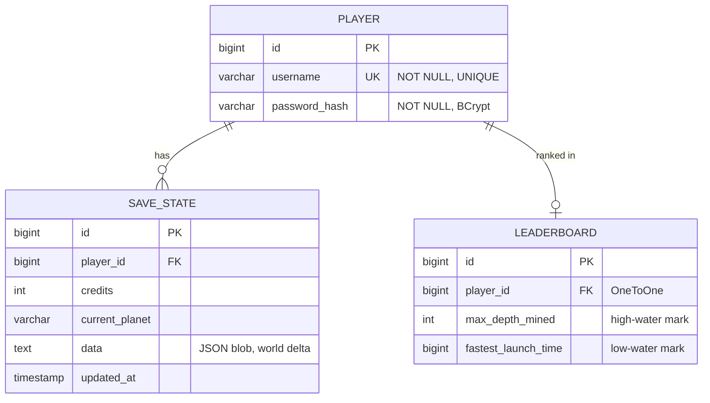

Key points to call out on the slide:

- `Player.username` carries a `UNIQUE` constraint, enforced both at the JDBC level and by `AuthService.register()`.
- `SaveState.data` is a `TEXT` column storing the full world delta as JSON (`SaveStateSerializer.GameSaveDto`, schema version 1).
- `Leaderboard` rows are never inserted with worse values; `GameService.saveProgress()` takes the max of `maxDepthMined` and the min non-zero of `fastestLaunchTime` on every save.

## 2. Sequence diagrams

Common participants across every sequence diagram:

- `Game` (the LibGDX client, usually triggered by a screen or HUD event)
- `BackendClient` (`network/BackendClient.java`, the HTTP wrapper)
- `GameController` (`@RestController` at `/api/game`)
- `AuthService` or `GameService` (the orchestration layer)
- `Repository` (Spring Data JPA, one per entity)
- `PostgreSQL` (the database)

All HTTP calls from the game are asynchronous: `BackendClient` issues the request via `Gdx.net.sendHttpRequest`, and the callback is marshalled back onto the LibGDX render thread with `Gdx.app.postRunnable()`.

### 2.1 Register

[`./img/sequence-register.png`](./img/sequence-register.png)

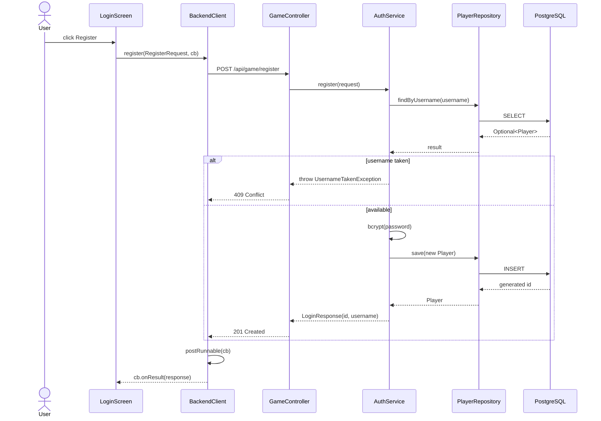

### 2.2 Login

[`./img/sequence-login.png`](./img/sequence-login.png)

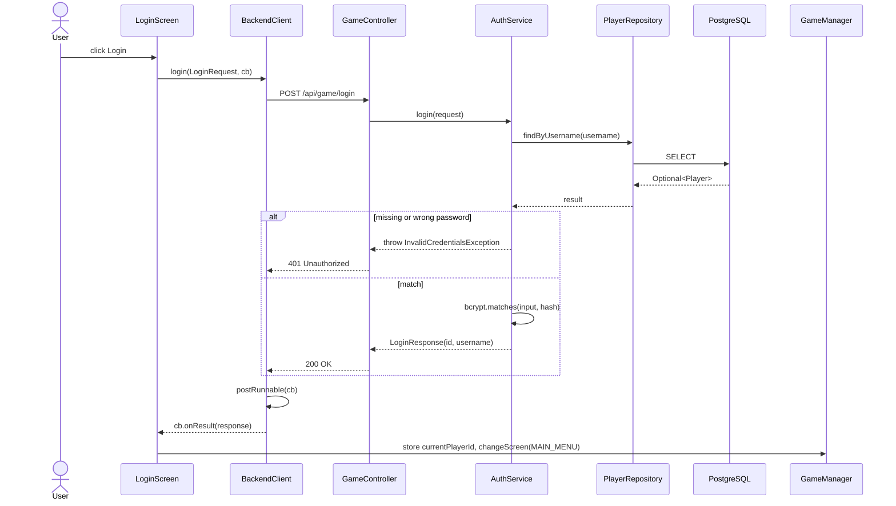

### 2.3 Save (F5 in PlayScreen)

[`./img/sequence-save.png`](./img/sequence-save.png)

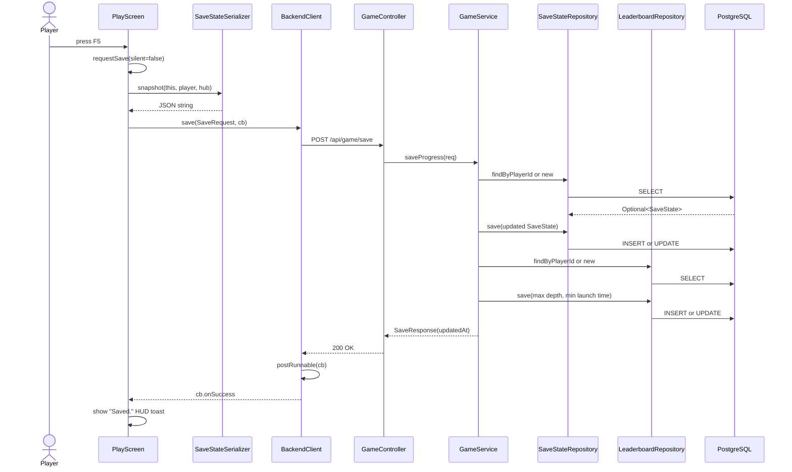

### 2.4 Load (Continue from main menu)

[`./img/sequence-load.png`](./img/sequence-load.png)

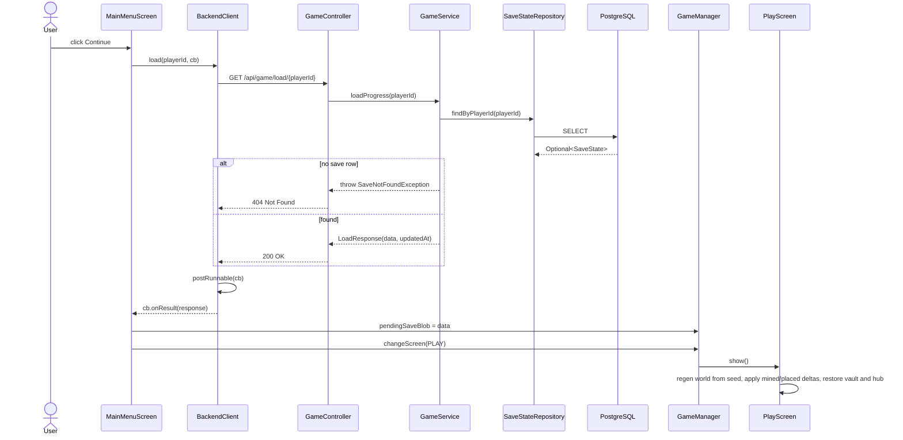

### 2.5 Leaderboard

[`./img/sequence-leaderboard.png`](./img/sequence-leaderboard.png)

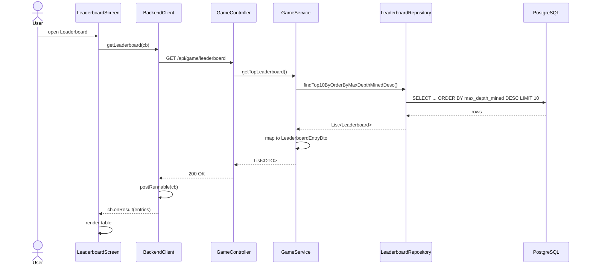

## 3. Gameplay flowchart

[`./img/gameplay-flowchart.png`](./img/gameplay-flowchart.png)

This flowchart traces a single player from app start to either a successful escape or a crash retry. It overlays both phases (mining and flight) so the cargo gate is visible as the bridge between them.

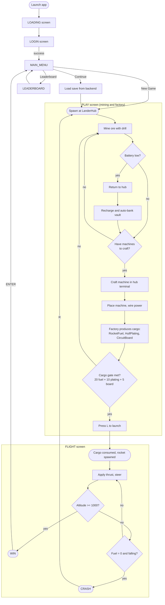

## 4. Screen state diagram

[`./img/screen-state.png`](./img/screen-state.png)

`GameManager.changeScreen(ScreenType)` is the only legal way to move between screens. Every transition below corresponds to a single `changeScreen()` call somewhere in the codebase.

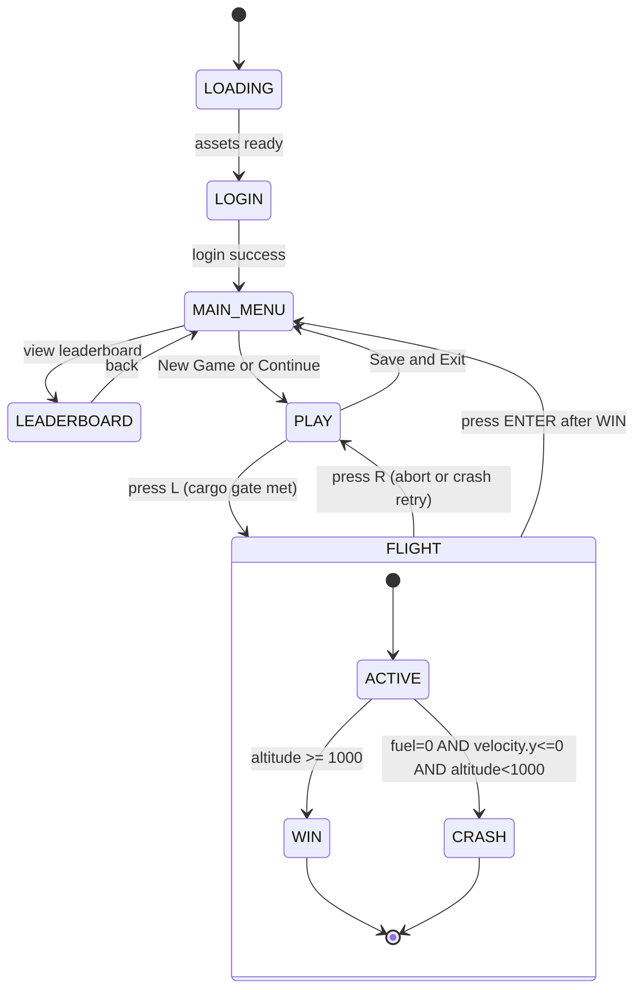

## 5. Design pattern class diagrams

Six diagrams, one per pattern. Each one shows only the participating classes plus the methods that demonstrate the pattern so they read well in slides.

### 5.1 Singleton (`GameManager`)

[`./img/pattern-singleton.png`](./img/pattern-singleton.png)

`GameManager` owns the game-wide singletons (the LibGDX `Game` reference, the `globalVault`, the current player id) and exposes a private constructor with `getInstance()`. Every screen calls `GameManager.getInstance()` rather than holding its own copy.

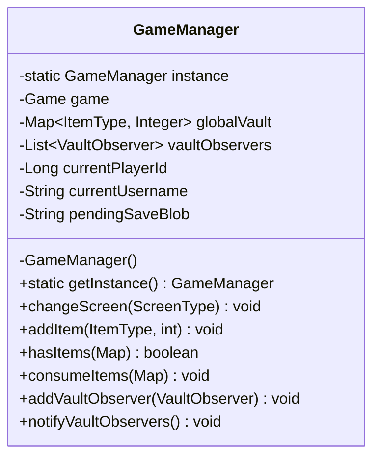

### 5.2 Object Pool (`Pool<Block>`)

[`./img/pattern-object-pool.png`](./img/pattern-object-pool.png)

`PlayScreen` allocates `Block` instances through a LibGDX `Pool<Block>` so mining and refilling tiles never trigger fresh allocations. `Block.reset()` is the hook that scrubs per-instance state (including `isPlayerPlaced`) when the pool reclaims an object.

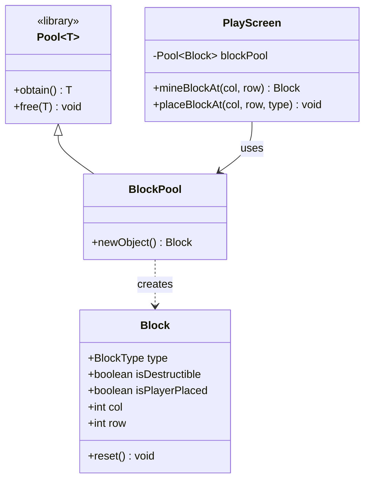

### 5.3 Observer (`VaultObserver`, `InventoryObserver`)

[`./img/pattern-observer.png`](./img/pattern-observer.png)

`Hud` registers as a `VaultObserver` against `GameManager` and as an `InventoryObserver` against `Player`. Whenever the vault or the player's inventory changes, the subjects iterate their listener list and call `onVaultUpdated()` or `onInventoryUpdated()` so the HUD repaints without polling.

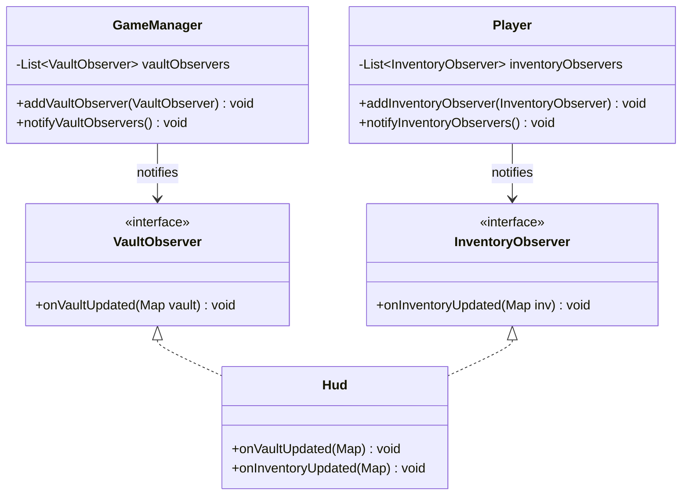

### 5.4 Factory Method (`MachineFactory`)

[`./img/pattern-factory.png`](./img/pattern-factory.png)

`MachineFactory.createMachine(String type, ...)` returns a concrete `Machine` subclass based on a string key. Save restoration and player placement both go through this single entry point so the rest of the codebase never instantiates machine subclasses directly.

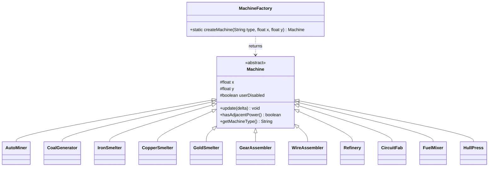

### 5.5 Strategy (`EngineStrategy`)

[`./img/pattern-strategy.png`](./img/pattern-strategy.png)

`Rocket` holds a reference to an `EngineStrategy` and delegates thrust and fuel-burn questions to whichever implementation is currently plugged in. Pressing `E` in `FlightScreen` swaps between `ChemicalEngine` (high thrust, high burn) and `IonEngine` (low thrust, low burn) without altering `Rocket` itself.

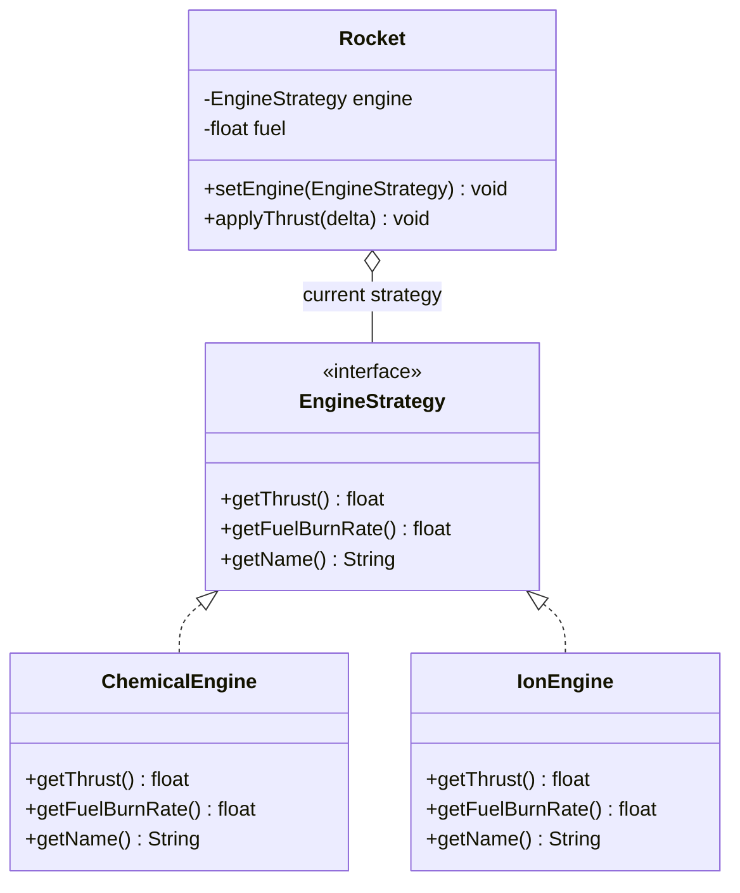

### 5.6 State (`FlightState`)

[`./img/pattern-state.png`](./img/pattern-state.png)

`FlightScreen` runs a three-state machine (`ACTIVE`, `WIN`, `CRASH`). Each update tick checks transition conditions; input handling branches on the current state so thrust and steering only apply in `ACTIVE`, and `ENTER` only works in `WIN`.

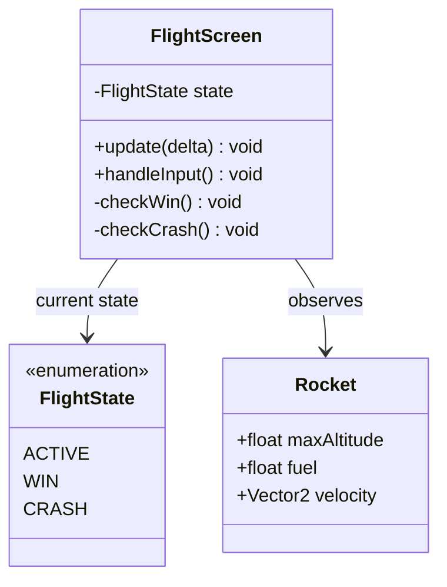
